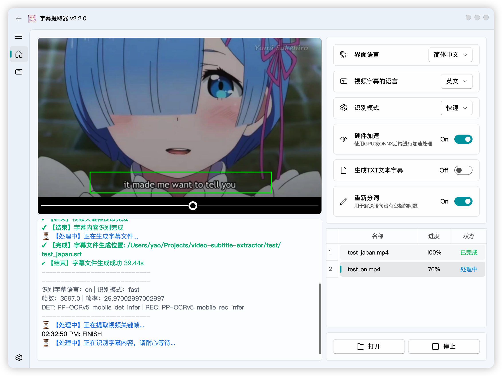

[简体中文](README.md) | English

# Video Subtitle Extractor — Blackwell Edition

This is an NVIDIA Blackwell / RTX 50-series optimized derivative of [YaoFANGUK/video-subtitle-extractor](https://github.com/YaoFANGUK/video-subtitle-extractor) 2.2.0.

It keeps the same core purpose: extracting hard-coded subtitles from video and generating SRT/TXT files. This edition mainly rebuilds the Windows + NVIDIA automatic-mode pipeline so RTX 50-series GPUs can use CUDA/NVDEC, fixed-rate sampling, and OCR micro-batching instead of falling back to the older slow path.

## Supported GPUs and use cases

This project targets **hardcoded subtitle extraction, video subtitle OCR, and batch SRT generation** on Windows with NVIDIA GPUs.

- General support target: GeForce RTX 5050, 5060, 5060 Ti, 5070, 5070 Ti, 5080, 5090, and their Laptop GPU variants.
- Runtime selection is based on NVIDIA CUDA, FFmpeg NVDEC/CUVID, and codec capabilities rather than hard-coded GPU names.
- Physically verified hardware: RTX 5060 8 GB. Community results for other RTX 50 models are welcome.
- Core technologies: NVIDIA Blackwell, CUDA, NVDEC, FFmpeg, PaddlePaddle, PaddleOCR, and PP-OCRv5.

<p align="center"></p>

## What changed

- RTX 50-series support is selected by actual CUDA, FFmpeg, and codec capability instead of a hard-coded GPU model name.
- Automatic mode uses **FFmpeg NVDEC + fixed 2 fps sampling + subtitle-region cropping + PP-OCRv5 mobile detection + server recognition**.
- A new opt-in, experimental **Smart / Accurate mode** detects timeline changes from subtitle-region images and sends only the sharpest key frame in each segment to OCR, keeping timing detection independent from recognised text.
- OCR calls now use a backend interface; the existing PP-OCRv5/PaddleOCR implementation remains the built-in default.
- Auto/Fast use two OCR engines with Batch 8 by default; initialization safely falls back to one engine when VRAM is insufficient.
- NVDEC falls back to the OpenCV sampling path when the current codec cannot be decoded by the installed FFmpeg build.
- H.264, HEVC, AV1, VP8/VP9, MPEG, VC-1, and MJPEG CUVID decoders are selected when available.
- All eight upstream interface languages and 87 OCR subtitle languages are retained.
- Setup, diagnostics, pure-logic tests, and GitHub Actions are included.

## Verified scope

Historical Auto-mode hardware validation baseline (not a Smart benchmark):

- GeForce RTX 5060 8 GB
- Compute Capability 12.0
- PaddlePaddle GPU 3.3.1
- CUDA 12.9
- PaddleOCR 3.4.1
- FFmpeg 8.1.2
- Windows 10/11 x64

The best historical reference run improved from **1237.78 s to 180.66 s**, about **6.85×** faster. The cleaned-up full regression completed in **225.76 s**, still about **5.48×** faster than the original path.

Previously recorded two-hour H.264 Auto-mode regression:

```text
Source: 215,916 frames / 29.97 fps
Sampled: 14,409 frames / 2.00 fps
Failed frames: 0
OCR engines: 2
Average micro-batch: 8.0
Final SRT: 672 cues
Total time: 225.76 s
```

These numbers only describe this test environment. GPU model, codec, resolution, subtitle region, and background load all affect performance. RTX 5050, 5060 Ti, 5070 / 5070 Ti, 5080, 5090, and Laptop GPU variants use the same capability-detection path, but they should not be described as physically verified until community hardware results are available.

## Download v0.2.0

- [Release notes](https://github.com/qiusan108/video-subtitle-extractor-blackwell/releases/tag/v0.2.0-blackwell)
- [Source ZIP](https://github.com/qiusan108/video-subtitle-extractor-blackwell/releases/download/v0.2.0-blackwell/vse-v0.2.0-blackwell-source.zip)
- [SHA256SUMS.txt](https://github.com/qiusan108/video-subtitle-extractor-blackwell/releases/download/v0.2.0-blackwell/SHA256SUMS.txt)

Download both files into the same folder and verify the ZIP before extracting it:

```powershell
$expected = ((Get-Content .\SHA256SUMS.txt -Raw).Trim() -split '\s+')[0]
$actual = (Get-FileHash .\vse-v0.2.0-blackwell-source.zip -Algorithm SHA256).Hash
if ($actual -ne $expected) { throw 'Source ZIP SHA-256 mismatch' }
Expand-Archive .\vse-v0.2.0-blackwell-source.zip -DestinationPath .
Set-Location .\vse-v0.2.0-blackwell
```

This is a source release, not a bundled executable or offline installer. The checksum applies to the named ZIP asset, not GitHub's separately generated “Source code” archives. It detects mismatched bytes; it is not a code-signing certificate. Install the requirements below, then run setup from the extracted folder. Existing v0.1.2 installations should download this source explicitly: their application version still reports upstream `2.2.0`, so their update check may miss this release.

## Setup

Requirements:

- Windows 10/11 x64
- Python 3.12 x64
- a recent NVIDIA driver
- FFmpeg with CUDA/CUVID decoders

Create or update the environment:

```powershell
powershell -NoProfile -ExecutionPolicy Bypass -File .\setup-blackwell.ps1
```

The source repository does not duplicate upstream heavyweight models, native tools, or test videos. On its first run, the setup script downloads the Windows runtime assets (about 448 MiB (470 MB)) from the pinned upstream 2.2.0 commit and verifies every SHA-256 checksum. Later runs reuse verified files. Run `download-assets.ps1` directly when only the assets need to be restored.

Run diagnostics:

```powershell
powershell -NoProfile -ExecutionPolicy Bypass -File .\diagnose.ps1
```

Launch:

```powershell
.\open.bat
```

FFmpeg may be available through PATH, an `ffmpeg` directory inside or next to the project, or through `VSE_FFMPEG_PATH`.

## Recommended starting point

- Mode: Automatic
- Draw a precise and narrow subtitle region manually
- Confidence threshold: 70
- Sampling: 2 fps
- OCR engines: 2
- Batch: 8

Smart / Accurate is an experimental option for evaluating image-based subtitle boundaries; better accuracy or speed has not been established. Draw a narrow, accurate subtitle region first. Automatic, Fast, and the legacy Accurate mode retain their previous behavior. Smart is the first-stage implementation and currently selects one sharp key frame per segment; multi-frame voting is not implemented. Smart currently uses OpenCV scanning and one OCR worker; the Auto-mode NVDEC/dual-worker benchmarks do not apply. New Windows GPU end-to-end results are still needed.

To compare with the server detector in the current terminal session:

```powershell
$env:VSE_AUTO_MOBILE_DET = '0'
.\open.bat
```

Smart mode can be tuned with these optional environment variables (defaults in parentheses):

- `VSE_SMART_SCAN_FPS`: subtitle-region analyses per second (`8`)
- `VSE_SMART_CHANGE_THRESHOLD`: visual change threshold (`0.08`; lower is more sensitive)
- `VSE_SMART_MIN_EDGE_DENSITY`: minimum edge density treated as subtitle content (`0.004`)
- `VSE_SMART_MIN_SEGMENT_MS`: shortest allowed segment (`250` ms)
- `VSE_OCR_BACKEND`: OCR backend name (currently built-in: `paddle`)

## Quality and compatibility boundary

Automatic mode uses the mobile detector for speed. Extremely thin, blurred, or low-contrast subtitles may be easier to miss, so important output should still be spot-checked at the beginning, middle, and end.

Larger GPUs should not blindly increase Batch size. Batch 16 did not improve the verified RTX 5060 run.

## Privacy

Video decoding, OCR, and subtitle generation run locally. Diagnostic output may contain the GPU model, driver version, FFmpeg path, and dependency versions. Review it before posting to an issue if local directory names are sensitive.

## Open source and upstream

This repository is a modified derivative of upstream VSE. It remains under the Apache License 2.0 and preserves upstream copyright and attribution.

- Changelog: [CHANGELOG.md](CHANGELOG.md)
- Contributing: [CONTRIBUTING.md](CONTRIBUTING.md)
- Security: [SECURITY.md](SECURITY.md)
- License: [LICENSE](LICENSE)
- Attribution: [NOTICE](NOTICE)

For performance reports, include the `diagnose.ps1` output, codec/resolution/frame rate, subtitle region, final SRT cue count, and total runtime.
