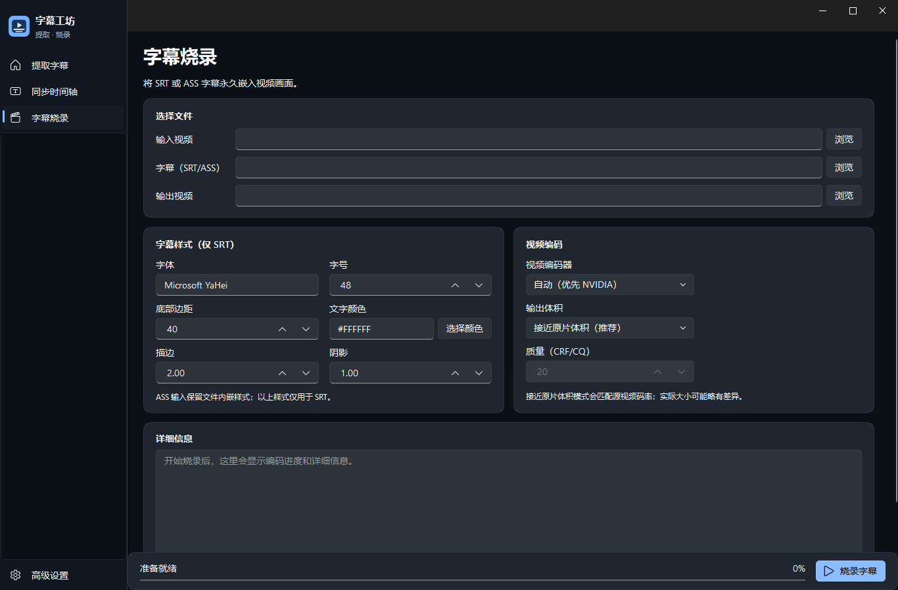

[简体中文](README.md) | English

# 字幕工坊 · Subtitle Studio

A Windows desktop tool to extract hardcoded subtitles, synchronize subtitle timing, and burn SRT/ASS subtitles into video. Derived from [YaoFANGUK/video-subtitle-extractor](https://github.com/YaoFANGUK/video-subtitle-extractor), with extraction optimizations for NVIDIA RTX 50 / Blackwell GPUs.



## Features

- **Extract subtitles:** Recognize text embedded in video frames and export SRT/TXT. Automatic, Fast, Accurate, and experimental Smart modes are available.
- **Synchronize timing:** Align an existing subtitle file with a video.
- **Burn subtitles:** Render SRT/ASS permanently into video. SRT styling includes font, size, color, outline, shadow, and bottom margin; ASS keeps its own styling. CPU and NVIDIA encoding, progress, and cancellation are supported.
- **Local processing:** Video, subtitles, and OCR stay on your computer.

## Get started

Download the new source archive from the [v0.3.0 release page](https://github.com/qiusan108/video-subtitle-extractor-blackwell/releases/tag/v0.3.0-blackwell). It includes the interface and burn-in workflow shown above. The older v0.2.0 release does not include burn-in. A standalone EXE is not available yet.

On Windows 10/11 x64, install Python 3.12 x64 and FFmpeg. Extraction requires an appropriate NVIDIA driver; burn-in requires an FFmpeg build with libass. Extract the new source archive and run from its directory:

```powershell
powershell -NoProfile -ExecutionPolicy Bypass -File .\setup-blackwell.ps1
.\open.bat
```

First-time setup downloads and verifies OCR models and native components. Pip installs Python dependencies separately. FFmpeg can be on PATH, in an `ffmpeg` folder inside or beside the project, or specified with `VSE_FFMPEG_PATH`. Run `diagnose.ps1` if setup fails.

## Notes

- For extraction, select a narrow and accurate subtitle region. Smart mode is experimental; published RTX 5060 performance results refer only to the earlier Auto mode.
- For burn-in, choose a video, SRT/ASS file, and output path. The default aims for a file size near the source, not an exact match. Quality-first mode may produce larger files.
- Burn-in re-encodes video, so long videos take time. ASS styling is not overridden by the SRT style controls.

## Open source and feedback

This derivative retains the upstream [Apache-2.0 license](LICENSE) and [attribution](NOTICE). See the [changelog](CHANGELOG.md) for development and validation details, or open an [issue](https://github.com/qiusan108/video-subtitle-extractor-blackwell/issues). Do not upload media or subtitles you lack permission to share.
